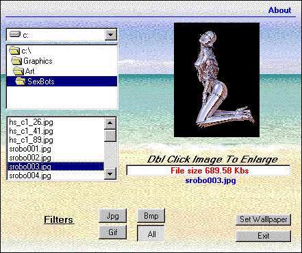



## Better Image Viewer

### Description

This started out as being a simple routine for my current project. All I needed was a routine to preview images to select from. It is now becomming a complete stand alone project. Features a small image as the preview, and by double clicking on the image you get a full sized view. The routine doesn't use any scroll bars to view the images.  The displayed image doesn't look funny by stretching it to fit the imagebox as it has a routine that scales the image to fit into the imagebox. You can also make the currently displayed image to be set as your wallpaper, if the selected image if a Gif or Jpg it will automatically be converted to a Bmp. The program handles file types of Bmp, Gif, Jpg and has Filters option to selectively display images. The progress bar functions based on the image size. Since it was orginally designed to be a routine for another project, the form traps the mouse so that the user must make a selection, this way it won't hide behind any other forms or programs that are displayed or running. Most all the routines were found on PSC and adapted accordingly. This is my first submission to PSC so comments are welcome, so be gentle and if you like it please be sure to vote!

Thanx

Rick
 
### More Info
 

             |
---                |---
**Submitted On**   |2001-04-11 00:01:38
**By**             |[Rick Racela](https://github.com/Planet-Source-Code/PSCIndex/blob/master/ByAuthor/rick-racela.md)
**Level**          |Intermediate
**User Rating**    |4.5 (18 globes from 4 users)
**Compatibility**  |VB 5\.0
**Category**       |[Complete Applications](https://github.com/Planet-Source-Code/PSCIndex/blob/master/ByCategory/complete-applications__1-27.md)
**World**          |[Visual Basic](https://github.com/Planet-Source-Code/PSCIndex/blob/master/ByWorld/visual-basic.md)
**Archive File**   |[Better Ima182484112001\.zip](https://github.com/Planet-Source-Code/rick-racela-better-image-viewer__1-22328/archive/master.zip)

